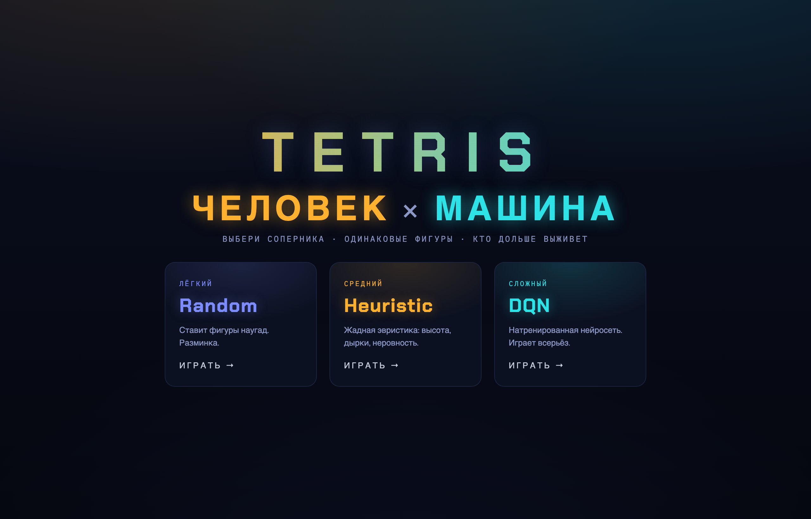
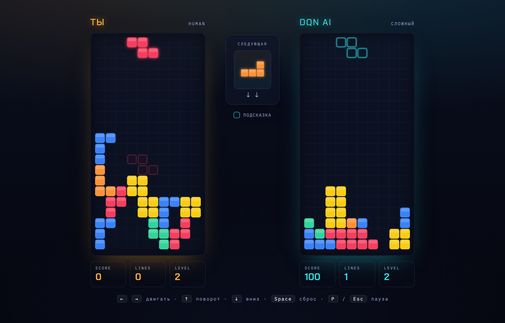

<div align="center">

# 🎮 Tetris RL Web — Человек против нейросети

**Веб-тетрис, где вы играете против агента, натренированного с помощью reinforcement learning.**
Два поля, одинаковые фигуры, один победитель. Всё считается прямо в браузере — бэкенда нет.

### 🕹️ [Играть онлайн → tetris-rl-web.vercel.app](https://tetris-rl-web.vercel.app/)

<a href="https://tetris-rl-web.vercel.app/"></a>
<a href="https://github.com/art-ps/tetris-rl"></a>


<a href="LICENSE.md"></a>



</div>

---

## ✨ Что это

Вы играете против ИИ-агента из проекта
[tetris-rl](https://github.com/art-ps/tetris-rl). Оба поля получают **одинаковую**
последовательность фигур. Вы играете текущую фигуру в реальном времени (скорость
падения растёт со временем), затем агент мгновенно ставит ту же фигуру на своём
поле — с анимацией. После этого оба синхронно переходят к следующей фигуре
(**lockstep**). Матч идёт до первого топ-аута: кто дольше выживет, тот и победил.

Сеть DQN (MLP `23→128→128→64→1`) исполняется **вручную на TypeScript** по весам,
выгруженным из чекпойнта PyTorch. Никаких внешних ML-библиотек в рантайме.



## 🤖 Соперники

| Соперник | Сложность | Как играет |
|----------|-----------|------------|
| **Random** | Лёгкий | Ставит фигуры наугад. Разминка. |
| **Heuristic** | Средний | Жадная эвристика: высота, дырки, неровность. |
| **DQN** | Сложный | Натренированная нейросеть. Играет всерьёз. |

> 💡 У DQN можно включить **«Подсказку»** — циан-контуры показывают варианты,
> которые взвешивает сеть, а `▶ Q` отмечает выбранный ход с его Q-значением.

## ⌨️ Управление

| Клавиша | Действие |
|---------|----------|
| `←` `→` | двигать |
| `↑` | поворот |
| `↓` | вниз (soft drop) |
| `Space` | сброс (hard drop) |
| `P` / `Esc` | пауза |

## 🚀 Разработка

```bash
npm install
npm run dev       # http://localhost:5173
npm test          # vitest: сверка порта с эталоном tetris-rl
npm run build     # статика в dist/
npm run preview
```

## 🧠 Веса нейросети

`src/ai/weights.json` уже сгенерирован. Чтобы пересобрать из другого чекпойнта
(нужен Python с torch):

```bash
python scripts/convert_weights.py [path/to/best.pt] [out.json]
# по умолчанию: ../tetris-rl/checkpoints/best.pt -> src/ai/weights.json
```

Эталон для тестов (фичи, Q-значения, valid actions) генерируется из tetris-rl:

```bash
python scripts/gen_fixtures.py   # -> src/game/__tests__/fixtures.json
```

## 📦 Деплой

Статическая сборка — кладётся на любой хостинг (Vercel, Netlify, VDS):

```bash
npm run build && npx vercel deploy dist --prod   # пример для Vercel
```

## 🏗️ Архитектура

```
src/
├── game/         чистый порт логики tetris-rl (без React)
│   ├── pieces    фигуры и повороты
│   ├── board     доска, валидные размещения
│   ├── features  23 фичи состояния
│   └── engine    правила матча, гравитация, уровни
├── ai/
│   ├── qnet      forward-pass DQN на чистом TS
│   └── agents    три агента + метаданные
├── store.ts      Zustand: lockstep-стейт-машина матча
└── components/   Canvas-доски, HUD, экран выбора
```

- **`src/game/`** — чистый порт логики из tetris-rl: фигуры, доска, валидные
  размещения, 23 фичи, правила матча. Полностью независим от React и покрыт
  тестами, сверяющими каждый шаг с эталоном из оригинального проекта.
- **`src/ai/`** — forward-pass сети (`qnet.ts`) и три агента (`agents.ts`).
- **`src/store.ts`** — Zustand-хранилище: lockstep-стейт-машина матча.
- **`src/components/`** — Canvas-доски, HUD, экран выбора соперника.
